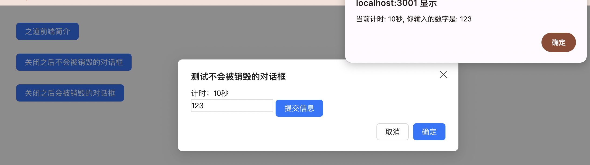

# `[P10-s2]` Modal 对话框组件-内容增强版

## 项目阶段简介

### 项目阶段介绍

按照设计稿和组件说明，扩展基础版 Modal 对话框组件的内容区域相关的功能。

对话框组件是一个容器组件，对话框的内容是完全可以被自定义的，而且里面的内容应该是由调用方自己来控制，对话框组件不会干涉对话框的内容。

因此，本阶段我们主要是扩展内容区域，让调用方可以自定义对话框内容。

另外有一个特别的功能，就是在对话框关闭时，要不要销毁内容。这是一个很常见的功能，具体是什么意思呢？来看下题目说明吧。

### 组件说明

- 可以通过自定义函数定制对话框的内容
- 可以自定义关闭对话框时是否要销毁对话框里的子元素

### 设计稿说明

- 第一行的按钮功能跟 s1 的一样，因为 s2 是在 s1 的基础上扩展而来的。
- 第二行的按钮点击之后，弹出对话框：
  - 对话框的标题：测试不会被销毁的对话框
  - 对话框的内容：
    - 第一行内容是：计时：x秒，在创建对话框时设置一个永久定时器，每隔 1 秒增加计时的秒数。
    - 第二行有一个数字输入框，然后旁边是一个【提交信息】按钮（这个按钮需要使用 [P6](https://github.com/ZhiDaoFE/P6-button-component) 项目实现的 Button 组件来创建），点击按钮之后，弹出一个系统告警提示，内容为：当前计时: x秒, 你输入的数字是: y。其中 x 是第一行中的秒数，y 是 input 框输入的内容。
  - 注意，对话框的内容不需要添加什么特别的样式，因为这里我们只关注功能。
  - 注意，第二行的按钮只有在第一次点击的时候才创建对话框，后续的所有点击都只是打开之前创建的对话框。
  
- 第三行的按钮点击之后的逻辑跟第二行的完全一样，在测试页面的代码中，可以直接把第二行的代码 copy 给第三行的按钮中，唯一不同的，第三行按钮点击之后创建对话框多了一个参数：`destroyOnClose: true`。这个参数的作用是：
  - 第二行按钮创建的对话框在关闭的时候 **不会** 被销毁，因此，如果在该对话框中的 input 输入框中输入了某个数字，然后关闭对话框，再点击一次按钮弹出之前的对话框时，计时的秒数仍然再之前的基础上增加，而且 input 输入框还显示之前输入的数字。
  - 第二行按钮创建的对话框在关闭的时候 **会** 被销毁，因此，如果在该对话框中的 input 输入框中输入了某个数字，然后关闭对话框，再点击一次按钮弹出之前的对话框时，计时的秒数会从 0 开始计时，而且 input 输入框是初始状态，没有之前输入的数字。

> 文字描述可能比较难懂，可以直接体验一下官方例子：[在线体验](https://zhidaofe.github.io/P10-modal-component/s2/index.html)

### 项目要求

- 增强版是要在基础版的 Message 全局提示组件上进行扩展的，因此把你的 s1 答案 copy 过来之后，再进行 s2 的练习
- 先按照设计稿和组件说明，实现组件代码。然后在页面中使用你实现的组件来达到题目要求
- **先按照设计稿和组件说明真得去开发，不要看参考答案！**，也不要去看业界和开源的组件库代码
- 如果开发过程中碰到问题，不知道怎么实现的话，去网上查找答案，不要去看答案！在真实的工作中，你不会有参考答案的，你只能自己想办法找到问题的解决方案
- 记录你的疑问，比如：
  - 有个很难实现的地方，总感觉自己实现的方案不是最优方案，还有更好的方案
  - 不知道自己的实现方案到底好不好
  - 完成开发之后，再整体 review 一遍自己的代码，觉得还有哪些地方是不够好的
- 带着你的疑问，再去查看参考答案或者开源组件库去寻找答案，如果还是没有得到解答，请来 [**之道前端**](https://kcnrozgf41zs.feishu.cn/wiki/PBj0w5rjUiEWVgktZE0caKOunNc) 提问

### 练习本项目你会收获什么？

- 提升原生 JavaScript 的编码熟练度
- 学会正确使用原生 JavaScript 创建 Dom、操作 Dom
- 学会正确使用原生 JavaScript 处理 DOM 事件绑定和解绑
- 学会正确处理资源回收，避免内存泄露
- 理解什么是 **关闭时销毁**
- 学会如何封装一个组件
- 【进阶】自定义组件内容的实现方式有很多种，通过实践理解不同实现方式的优缺点
- 【进阶】深刻理解什么是好的组件
- 【进阶】积累封装组件的经验
- 【进阶】逐渐形成自己的 JavaScript 代码风格

> 如果只实践一次，那就只会有基础收获
>
> 只有不断练习、思考、优化，才会有进阶收获

### 本项目适合的同学

- 处于 L2 水平的同学
- 对原生 JavaScript 还不熟练的同学
- 没怎么封装过 UI 组件的同学
- 没怎么写过 C 端页面，大部分时间在做 admin 系统的同学
- 只会开发 React/Vue 组件，想要练习如何封装原生 JavaScript 组件的同学

## 开始练习

我们针对不同经验的同学提供了相应的[练习指引手册](https://kcnrozgf41zs.feishu.cn/wiki/An7GwvUQrirdvdkJdQ9c4q3Rndd)，你可以按照这个指引手册来练习本项目。

