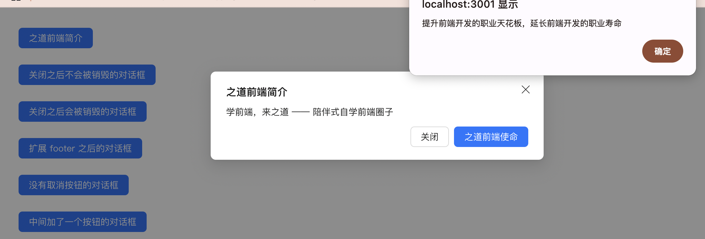

# `[P10-s3]` Modal 对话框组件-footer 增强版

## 项目阶段简介

### 项目阶段介绍

按照设计稿和组件说明，继续扩展基础版 Modal 对话框组件的 `footer` 区域相关的功能。

在基础版 Modal 对话框组件中，footer 区域固定是 2 个按钮：【取消】按钮和【确定】按钮。

而且这两个按钮几乎不可以被定制，比如按钮的文案，按钮的样式，按钮的行为等等。

如果让 footer 区域完全自定义，那调用方使用我们的组件会非常麻烦，因为大部分场景都是【取消】按钮和【确定】按钮，我们不用去实现这两个基础按钮。

但是我们又需要可扩展的能力，能够支持一些特殊场景：比如我们不想展示【取消】按钮，比如我们想多展示其他的自定义按钮。

如何平衡系统内置功能的 **易用性** 和自定义功能的 **可扩展性**？

看起来真有点头痛呢，你会怎么办呢？来尝试一下吧。

### 组件说明

- 可以扩展 footer 的按钮
- 可以自定义 footer 的内容
- 使用 [[P6] Button](https://github.com/ZhiDaoFE/P6-button-component) 组件作为默认按钮的实现，并且可以通过传递 props 的方式来扩展按钮的功能

### 设计稿说明

- 按照惯例，前三行的按钮功能跟 s2 的一样，因为 s3 是在 s2 的基础上扩展而来的。
- 第四行的按钮点击之后，弹出对话框：
  - 对话框的标题，内容都跟第一行按钮的对话框一样，你可以 copy 第一行按钮的对话框配置来做修改。
  - 对话框的【取消】按钮的文案修改为【关闭】。
  - 对话框的【确定】按钮的文案修改为【之道前端使命】，点击之后，弹出一个系统告警提示，内容为：提升前端开发的职业天花板，延长前端开发的职业寿命。在这个系统告警提示中点击确定按钮之后，关闭对话框。
- 第五行的按钮点击之后，弹出对话框：
  - 对话框的标题、内容和【确定】按钮都跟第一行按钮的对话框一样，你可以 copy 第一行按钮的对话框配置来做修改。
  - 没有【取消】按钮

- 第六行的按钮点击之后，弹出对话框：
  - 对话框的标题、内容、【取消】按钮和【确定】按钮都跟第一行按钮的对话框一样，你可以 copy 第一行按钮的对话框配置来做修改。
  - 在【取消】按钮和【确定】按钮中间，增加一个【之道前端的使命】按钮，点击之后，弹出一个系统告警提示，内容为：提升前端开发的职业天花板，延长前端开发的职业寿命。在这个系统告警提示中点击确定按钮之后，关闭对话框。

> [在线体验](https://zhidaofe.github.io/P10-modal-component/s3/index.html)

### 项目要求

- footer 增强版是要在内容增强版的 Modal 对话框组件上进行扩展的，因此把你的 s2 答案 copy 过来之后，再进行 s3 的练习
- 通过引用你在  [[P6] Button](https://github.com/ZhiDaoFE/P6-button-component) 项目中实现的组件代码，来实现 Modal 对话框组件的默认按钮
- 先按照设计稿和组件说明，实现组件代码。然后在页面中使用你实现的组件来达到题目要求
- **先按照设计稿和组件说明真得去开发，不要看参考答案！**，也不要去看业界和开源的组件库代码
- 如果开发过程中碰到问题，不知道怎么实现的话，去网上查找答案，不要去看答案！在真实的工作中，你不会有参考答案的，你只能自己想办法找到问题的解决方案
- 记录你的疑问，比如：
  - 有个很难实现的地方，总感觉自己实现的方案不是最优方案，还有更好的方案
  - 不知道自己的实现方案到底好不好
  - 完成开发之后，再整体 review 一遍自己的代码，觉得还有哪些地方是不够好的
- 带着你的疑问，再去查看参考答案或者开源组件库去寻找答案，如果还是没有得到解答，请来 [**之道前端**](https://kcnrozgf41zs.feishu.cn/wiki/PBj0w5rjUiEWVgktZE0caKOunNc) 提问

### 练习本项目你会收获什么？

- 提升原生 JavaScript 的编码熟练度
- 学会正确使用原生 JavaScript 创建 Dom、操作 Dom
- 学会正确使用原生 JavaScript 处理 DOM 事件绑定和解绑
- 学会如何封装一个组件
- 学会如何引用其他组件来实现组件
- 学会如何让调用方扩展组件功能和结构
- 【进阶】深刻理解如何开发高可扩展的组件
- 【进阶】深刻理解什么是好的组件
- 【进阶】积累封装组件的经验
- 【进阶】逐渐形成自己的 JavaScript 代码风格

> 如果只实践一次，那就只会有基础收获
>
> 只有不断练习、思考、优化，才会有进阶收获

### 本项目适合的同学

- 处于 L2 水平的同学
- 对原生 JavaScript 还不熟练的同学
- 没怎么封装过 UI 组件的同学
- 没怎么写过 C 端页面，大部分时间在做 admin 系统的同学
- 只会开发 React/Vue 组件，想要练习如何封装原生 JavaScript 组件的同学

## 开始练习

我们针对不同经验的同学提供了相应的[练习指引手册](https://kcnrozgf41zs.feishu.cn/wiki/An7GwvUQrirdvdkJdQ9c4q3Rndd)，你可以按照这个指引手册来练习本项目。

